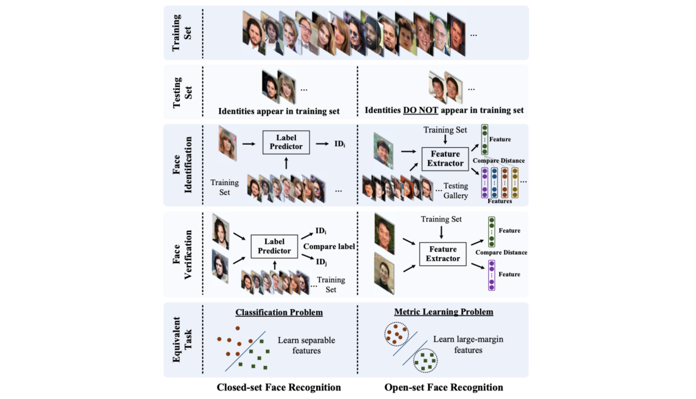
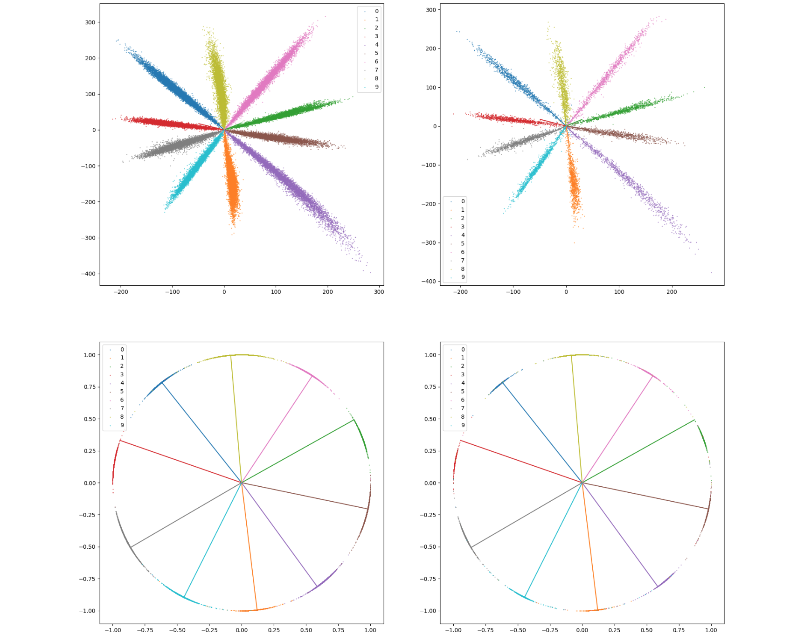
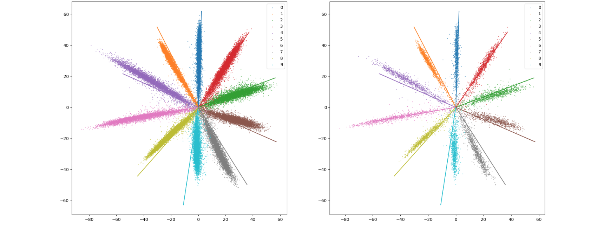
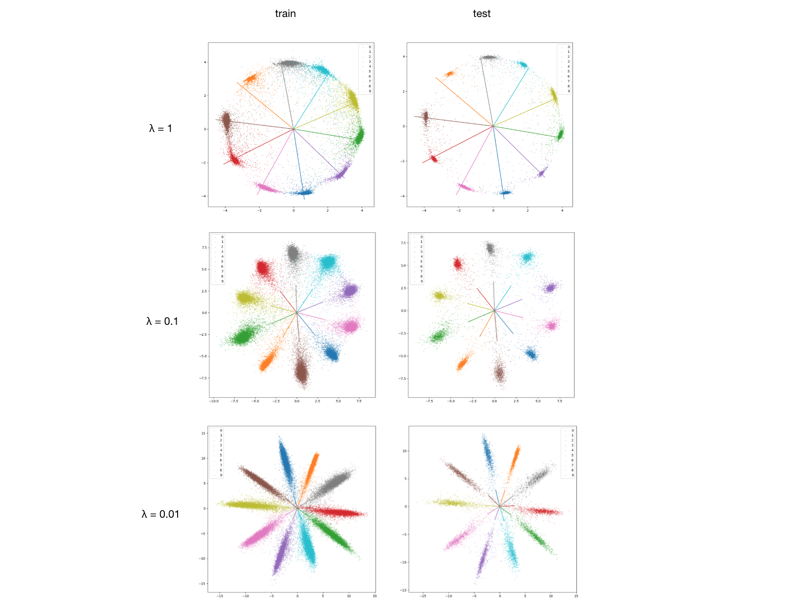
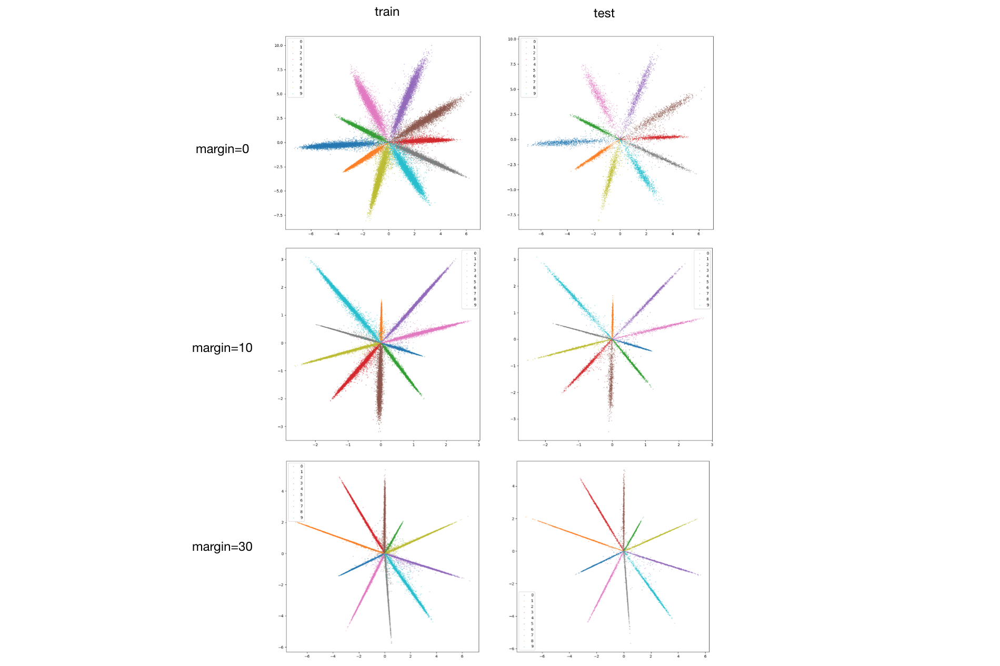

# TL;DR

* **Repo的主要内容：**
  * 在分类问题上，讨论对 softmax based loss function的理解
  * 基于Pytorch，在 mnist 和 fashion-mnist 数据集上复现相关 trick，具体包括：
    1. normalization 相关的 trick：L2-softmax，normface，RingLoss
    2. margin 相关的 trick：am-softmax（cosface），arcface
* **Repo 的整体组织：**
  * README.md：讨论我对 softmax based loss function的理解
  * summary目录：从 worklog 中抽取出的所有实验结果的表格
  * data 目录：数据集预览图
  * src目录：具体每个实验源代码
  * train_log目录：具体每个实验的 worklog，相关曲线和二维花瓣图

ps：如果后文 latex 公式没有渲染，戳[这里](https://chrome.google.com/webstore/detail/mathjax-plugin-for-github/ioemnmodlmafdkllaclgeombjnmnbima/related)可以下载一个 chrome 的插件

* [TL;DR](#TL;DR)
* [softmax based loss function](#softmax-based-loss-function)
   * [先从 softmax loss 说起](#先从-softmax-loss-说起)
      * [softmax loss](#softmax-loss)
      * [我对 softmax 的理解](#我对-softmax-的理解)
         * [为什么要用 softmax](#为什么要用-softmax)
         * [bias 的讨论](#bias-的讨论)
         * [模长和角度的讨论](#模长和角度的讨论)
      * [softmax的问题](#softmax的问题)
   * [softmax loss 的相关改进工作](#softmax-loss-的相关改进工作)
      * [normalization相关](#normalization相关)
      * [增加 margin 相关](#增加-margin-相关)
   * [实验验证](#实验验证)
      * [二维feature可 视化](#二维feature可视化)
      * [mnist实验结果](#mnist实验结果)
      * [fashion-mnist 实验结果](#fashion-mnist-实验结果)
   * [References](#references)

# softmax based loss function

讨论在人脸识别任务上 softmax based loss function的一些改进工作。

上图([来源戳这里](https://arxiv.org/abs/1704.08063))对人脸识别任务做了大致的介绍。通常人脸识别分为 Closed-set和 Open-set，主要区别在identities 是否出现在训练集中。实际场景通常为Open-set，无论是 identification 任务还是 verification 任务，本质都是 metric learning 问题。希望学习到一个discriminative的 $feature$ 表达，即 $input$ 图片，经过网络变换得到 $feature$。在 $feature$ 所在空间，**类内紧凑且类间距大**。在实际使用时，既可通过计算 $feature$ 间的距离，卡阈值来做出判定。

著名的contrastive loss，triplet loss 等方法由于遍历需要$O(N)$和$O(N^2)$复杂度，无法简单遍历，有效搜索则需要面临"难样本挖掘"问题，训练过程复杂。而 softmax loss 遍历复杂度为$O(N)​$，但只保证了可分却并不保证discriminative。由此许多基于 softmax loss 的改进被提出讨论。

## 先从 softmax loss 说起

### softmax loss

网络最后一层通常认为是一个分类器，
$$
p = Wx+b
$$
其中，

1. $W​$ 和 $ b​$ 是最后一层(Classification layer)的参数，**$W​$ 可以认为是每个类别的分类中心**， $b​$ 给每个类别加了一个偏置bias。

2. **$x$** 是网络导数第二层(feature extraction layer)的输出，之前的网络可以认为是特征提取器。**$x$可以理解为提取到的特征feature**。
3. 最一层的输出 **$p​$ 即分类结果，可以认为是样本和类别的相似度或者得分**。

具体地， softmax loss 为：
$$
L_{softmax} = - \sum_{i=1}^{m} log\frac{e^{W_{y_i}^Tx_i + b_{y_i}}}{\sum_{j=1}^{n}e^{W_{j}^Tx_i + b_{j}}}
$$
本质是网络最后一层的分类器输出 $p$ ，经过 softmax 函数放大后，得到的交叉熵Loss。由于分类结果是one-hot 编码的，所以实际只关注了正确类别对应softmax函数的输出。

### 我对 softmax 的理解

softmax函数本质上是对分类器输出不同类别得分 $p$ 的一种重分布，即用指数函数 $e^x$ 把不同类别之间的差距拉开，再算出每个类别在单位$1$中得分的占比。正确类别 softmax 后的得分越接近于$1$，$L_{softmax}$ 越小。

指数函数的爆炸式增长是非常厉害的；当输入值的范围在较大值时，非常微小的差别也能被拉开；到输入值范围很小时，非常大的差别也不怎么拉得开差距。分类器输出的得分 $p$，会通过指数函数做出调整。

举个例子，有三个类别

1. $(p^1, p^2, p^3) = (2,1,1)$，经过 softmax 放大后，正确类别的概率为$\frac{e^2}{e^2+e^1+e^1} = 57.6\%$；
2. $(p^1, p^2, p^3) = (10,5,5)$，经过 softmax 放大后，正确类别的概率为$\frac{e^{10}}{e^5+e^5+e^5} = 98.7\%$；

实际上在经过 softmax 放大前，正确类别的概率 $\frac{2}{2+1+1} = \frac{10}{10+5+5} = 50\%$，都是一样的。

所以 $p$ 中除了各个类别的相对大小重要外，各个类别得分的范围也非常的重要。

#### 为什么要用 softmax

$p$ 也代表了样本和类别的相似度，为什么还要用 softmax？

1. $p$ 有可能是负值，不能直接用于计算类别的概率
2. softmax中的指数操作，可以迅速放大差异，使得“**正确类别概率接近于1**”的目标变得简单很多。

#### bias 的讨论

$p$ 的计算如下：
$$
p = Wx+b
$$
其中，$b$ 是一个单纯加在各个类别上偏置，**本质上在各个类别不应该区别对待，每个类别的 $b$  应该是一个相同的数，如$0$ **。

#### 模长和角度的讨论

设 $b = 0$，
$$
p = Wx = ||W||*||x||*cos(\theta) = s * cos(\theta)
$$
某个类别的 $p$ 由 weight 的模长，feature 的模长，以及两者之间的夹角决定。通常认为，简单类别学到的 weight 的模长更长，难类别的模长更短；简单样本学到的 feature模长更长，难样本学到的 feature 模长更短。

许多 normalization 相关的改进大抵从 weight 和 feature 的模长是否归一化这一角度切入。

基于 margin 的改进大多在 $\theta$ 和 $cos (\theta)$  想把正确类别和别的类别的 margin 拉大上做优化。

此外 $||W||*||x||$ 或者 $s$ 限制了 $p$ 能达到的最大值和最小值，影响也非常大，过大和过小都不好。过大，$\theta$ 只要大一点就好，不利于拉开 margin；过小，$\theta$ 哪怕大了很多，分对概率变化不大，不同类别间很难分开。 

### softmax的问题

在 mnist 数据集上使用 softmax 实验，训练40个 epoch，为了可视化将 feature 的维度设为2，测试集准确率为 97.61%。下图为train 集 feature 和 weight 的分布，val 集分布类似。其中 weight 的实际模长远小于 feature 的模长，在画图的时候放大了50倍。

粗看，网络学到了不错的feature 分布，各个类别可分。**但仔细看 weight方向，居然和花瓣feature的方向不一致，但准确率在97.6%，非常不合理** 思考了很久，想明白如灰色类别为什么判对，就能理解图没有画错。分析如下：

1. 粗看，灰色样本理论上都会被判成蓝绿色类别，因为蓝绿色类别的 weight 中心在灰色类别的花瓣中心。
2. 实际上，蓝绿色类别weight的模长小于灰色类别weight 的模长。对于某一灰色样本，虽然在cosine similarity 上，和蓝绿色类别的距离更近；但实际上的相似度是 weight 和 feature 点积得到的结果。考虑 **weight 模长**的影响，灰色样本和其对应weight 模长的点积可能微弱地更大一些。
3. 此外，不同类别的不同的 **bias** 也会造成影响
4. 同时，注意到 **feature模长**的量级，约在300。由于softmax 函数指数爆炸式的拉大差距，紫色样本分对概率大大增加，即 loss 大大降低。
5. 别的类别的分析同理。

基于上述分析，尝试以下简单验证：

1. **去掉 bias**，对上述问题有改善

2. **对 weight 做L2 normalization**，weight 的方向和花瓣的 feature 分布方向一致，第二行对 feature 和 weight 都做了 norm，可以更直观的感受到 weight的方向在 feature 的中心

3. **增加 weight decay**（从1e-5变到1e-3），weight 的方向和花瓣的 feature 分布方向基本一致，存在偏差

由此：

1. 如果限制不同类别weight 的模长到单位模长（去掉 bias），花瓣中心和 weight 方向必然一致。**weight normalization 本质上决定了weight 的方向是否在 feature 分布的中心，即可以用 weight 来代表 feature 中心。**
2. 如果限制 feature的模长，feature 的模长越小，角度是否一致的造成的影响越显著，就越 push 网络学到的 weight 能代表分类中心
3. **bias会对结果造成影响，建议去掉**

## softmax loss 的相关改进工作

### normalization相关

| name       | motivation                                                   | contribution                                                 | loss function                                                | weight norm?            | feature norm? |
| ---------- | ------------------------------------------------------------ | ------------------------------------------------------------ | ------------------------------------------------------------ | ----------------------- | ------------- |
| L2-softmax | 发现softmax的feature norm和image quality正相关。容易的sample fit的好，norm大，难的相反。 | 首次提出在 softmax 前，加入 feature normalization            | 同*Softmax*，区别是feature $x$被normalize，然后乘一个scale参数。 | N                       | Y             |
| Normface   | inference用 cosine similarity，而训练是用的点乘并不是，存在 gap。 | 1. 和L2-Softmax同时期，同时做了feature和weight normalization。 2. norm 到1不收敛，scalse 很重要 3. weight 可以认为是分类中心 ，可以修改metric learning中的contrastive loss和triplet loss，配合使用 | 同*Softmax*，区别是weight和feature都被normalize到一个固定的norm参数。 | Y                       | Y             |
| Ring Loss  | L2-Softmax和NormFace都是在网络内部直接对于feature做hard normalization，并没有真的训练出"具有同样norm的feature" | 引入额外的 Loss，用soft的方式限制feature norm。              | $L _ { R } = \frac { \lambda } { 2 m } \sum _ { i = 1 } ^ { m } \left( \left\|\mathcal { F } \left( \mathbf { x } _ { i } \right) \right\|_ { 2 } - R \right) ^ { 2 }$ | 根据 loss，做 soft norm | N             |
|            |                                                              |                                                              |                                                              |                         |               |

 

### 增加 margin 相关

| name       | motivation                            | contribution                                                 | loss function                                                | weight norm? | feature norm? |
| ---------- | ------------------------------------- | ------------------------------------------------------------ | ------------------------------------------------------------ | ------------ | ------------- |
| L-Softmax  | Large-Margin Softmax Loss             | 首次提出在softmax loss中加入 angular margin的概念；基于乘法强行放大margin。 | [*softmax loss*]的区别就是，将分子和分母中原本的$cos\theta_{y_i,i}$变成$m*cos\theta_{y_i,i}$i | N            | N             |
| A-softmax  | L-Softmax的改进，angular softmax loss | 唯一的改进是作了weight的normalization                        | 和[*L-Softmax*]的差别就是少了所有的 $||W||$                  | Y            | N             |
| AM-softmax | L-softmax 和 A-softmax 难以优化收敛； | 在A-Softmax基础上做了feature normalization，margin从乘法变成加法，angular margin 变成 cosine margin | *A-Softmax*的差别就是少了所有的$||x||$                       | Y            | Y             |
| CosFace    |                                       | 同 AM-softmax                                                |                                                              |              |               |
| ArcFace    |                                       | 改了加adaptive margin 的方式，从加性 cosine margin 变成加性 angular margin | 同[*AM-Softmax, CosFace*]的差别是$m$从$cos​$外部到了内部      | Y            | Y             |
|            |                                       |                                                              |                                                              |              |               |

## 实验验证

在 mnist 和 fashion-mnist实验，训练40个 epoch，batchsize为64，learning rate为1e-3，weight decay 1e-3

### 二维feature可视化

原始 softmax 和部分 normalization 相关的 trick 后的结果，在 softmax 分析部分已展示，下面展示不一样形态的 softmax 的变种。

**RingLoss：**

**arcface**

### mnist实验结果

| experiment                                                   | best-acc | best-epoch |
| ------------------------------------------------------------ | -------- | ---------- |
| mnist.softmax.weight_decay1e-3.feature2.normface.scale1      | 0.8841   | 28         |
| mnist.softmax.weight_decay1e-3.feature2.normweight.ringloss.1 | 0.9585   | 37         |
| mnist.softmax.weight_decay1e-3.feature2.ringloss.1           | 0.9667   | 26         |
| mnist.softmax.weight_decay1e-3.feature2.amsoftmax.scale10.margin0.01 | 0.9727   | 37         |
| mnist.softmax.weight_decay1e-3.feature2.normfeature.scale1   | 0.973    | 40         |
| mnist.softmax.weight_decay1e-3.feature2.normface.scale50     | 0.9745   | 33         |
| mnist.softmax.weight_decay1e-3.feature2.arcface.scale10.margin0 | 0.9749   | 35         |
| mnist.softmax.weight_decay1e-3.feature2.normface.scale5      | 0.9761   | 37         |
| mnist.softmax.weight_decay1e-3.feature2.normweight.ringloss.0.1 | 0.9767   | 25         |
| mnist.softmax.weight_decay1e-3.feature2.amsoftmax.scale10.margin0 | 0.9775   | 29         |
| mnist.softmax.weight_decay1e-3.feature2.normfeature.scale10  | 0.9781   | 29         |
| mnist.softmax.weight_decay1e-3.feature2.normface.scale20     | 0.9783   | 40         |
| mnist.softmax.weight_decay1e-3.feature2.normfeature.scale5   | 0.9784   | 27         |
| mnist.softmax.weight_decay1e-3.feature2.normfeature.scale20  | 0.9789   | 36         |
| mnist.softmax.weight_decay1e-3.feature2.normface.scale10     | 0.9791   | 37         |
| mnist.softmax.weight_decay1e-3.feature2.amsoftmax.scale10.margin0.3 | 0.9791   | 32         |
| mnist.softmax.weight_decay1e-3.feature2.normweight           | 0.9793   | 39         |
| mnist.softmax.weight_decay1e-3.feature2.ringloss.0.1         | 0.9796   | 29         |
| mnist.softmax.weight_decay1e-3.feature2.normfeature.scale50  | 0.9798   | 33         |
| mnist.softmax.weight_decay1e-3.feature2                      | 0.9807   | 29         |
| mnist.softmax.weight_decay1e-3.feature2.amsoftmax.scale10.margin0.1 | 0.9808   | 38         |
| mnist.softmax.weight_decay1e-3.feature2.ringloss.0.01        | 0.9812   | 37         |
| mnist.softmax.weight_decay1e-3.feature2.normweight.ringloss.0.01 | 0.9819   | 40         |
| mnist.softmax.weight_decay1e-3.feature2.amsoftmax.scale10.margin0.2 | 0.983    | 34         |
| mnist.softmax.weight_decay1e-3.feature2.arcface.scale10.margin10 | 0.9832   | 40         |
| mnist.softmax.weight_decay1e-3.feature2.arcface.scale10.margin20 | 0.9841   | 32         |
| mnist.softmax.weight_decay1e-3.feature2.arcface.scale10.margin30 | 0.9853   | 23         |

### fashion-mnist 实验结果

| experiment                                                   | best-acc | best-epoch |
| ------------------------------------------------------------ | -------- | ---------- |
| fashion_mnist.softmax.weight_decay1e-3.feature2.arcface.scale10.margin20 | 0.6443   | 38         |
| fashion_mnist.softmax.weight_decay1e-3.feature2.arcface.scale10.margin30 | 0.7905   | 23         |
| fashion_mnist.softmax.weight_decay1e-3.feature2.amsoftmax.scale10.margin0.3 | 0.8061   | 40         |
| fashion_mnist.softmax.weight_decay1e-3.feature2.normweight.ringloss.1 | 0.8126   | 40         |
| fashion_mnist.softmax.weight_decay1e-3.feature2.normface.scale1 | 0.8206   | 39         |
| fashion_mnist.softmax.weight_decay1e-3.feature2.normfeature.scale1 | 0.8361   | 36         |
| fashion_mnist.softmax.weight_decay1e-3.feature2.normfeature.scale20 | 0.8391   | 35         |
| fashion_mnist.softmax.weight_decay1e-3.feature2.amsoftmax.scale10.margin0 | 0.8403   | 33         |
| fashion_mnist.softmax.weight_decay1e-3.feature2.normface.scale5 | 0.8425   | 35         |
| fashion_mnist.softmax.weight_decay1e-3.feature2.ringloss.1   | 0.8473   | 36         |
| fashion_mnist.softmax.weight_decay1e-3.feature2.normfeature.scale10 | 0.849    | 35         |
| fashion_mnist.softmax.weight_decay1e-3.feature2.normface.scale10 | 0.8495   | 38         |
| fashion_mnist.softmax.weight_decay1e-3.feature2.normweight.ringloss.0.1 | 0.851    | 40         |
| fashion_mnist.softmax.weight_decay1e-3.feature2.normfeature.scale50 | 0.8532   | 32         |
| fashion_mnist.softmax.weight_decay1e-3.feature2.normface.scale50 | 0.8534   | 39         |
| fashion_mnist.softmax.weight_decay1e-3.feature2.amsoftmax.scale10.margin0.2 | 0.8543   | 39         |
| fashion_mnist.softmax.weight_decay1e-3.feature2.normfeature.scale5 | 0.8545   | 35         |
| fashion_mnist.softmax.weight_decay1e-3.feature2.arcface.scale10.margin0 | 0.855    | 35         |
| fashion_mnist.softmax.weight_decay1e-3.feature2.normface.scale20 | 0.8573   | 32         |
| fashion_mnist.softmax.weight_decay1e-3.feature2.normweight   | 0.858    | 32         |
| fashion_mnist.softmax.weight_decay1e-3.feature2              | 0.8597   | 35         |
| fashion_mnist.softmax.weight_decay1e-3.feature2.arcface.scale10.margin10 | 0.8601   | 31         |
| fashion_mnist.softmax.weight_decay1e-3.feature2.normweight.ringloss.0.01 | 0.8662   | 37         |
| fashion_mnist.softmax.weight_decay1e-3.feature2.amsoftmax.scale10.margin0.1 | 0.8682   | 37         |
| fashion_mnist.softmax.weight_decay1e-3.feature2.ringloss.0.01 | 0.8688   | 29         |
| fashion_mnist.softmax.weight_decay1e-3.feature2.ringloss.0.1 | 0.8693   | 37         |

## References

| name              | year, publication    | title                                                        | link                               |
| ----------------- | -------------------- | ------------------------------------------------------------ | ---------------------------------- |
| *L2-Softmax*      | 2017, arxiv          | L2-constrained Softmax Loss for Discriminative Face Verification | https://arxiv.org/abs/1703.09507   |
| *NormFace*        | 2017, ACM MultiMedia | NormFace: L2L2 Hypersphere Embedding for Face Verification   | https://arxiv.org/abs/1704.06369   |
| *RingLoss*        | 2018, CVPR           | Ring loss: Convex Feature Normalization for Face Recognition | https://arxiv.org/abs/1803.00130   |
|                   |                      |                                                              |                                    |
| *L-Softmax*       | 2016, ICML           | Large-Margin Softmax Loss for Convolutional Neural Networks  | https://arxiv.org/abs/1612.02295   |
| *A-Softmax*       | 2017, CVPR           | SphereFace: Deep Hypersphere Embedding for Face Recognition  | https://arxiv.org/abs/1704.08063   |
| *CosFace*         | 2018, CVPR           | CosFace: Large Margin Cosine Loss for Deep Face Recognition  | <https://arxiv.org/abs/1801.09414> |
| *AM-Softmax*      | 2018, ICLR workshop  | Additive Margin Softmax for Face Verification                | <https://arxiv.org/abs/1801.05599> |
| *ArcFace*         | 2018, arxiv          | ArcFace: Additive Angular Margin Loss for Deep Face Recognition | <https://arxiv.org/abs/1801.07698> |
|                   |                      |                                                              |                                    |
| *HeatedUpSoftmax* | 2018                 | Heated-Up Softmax Embedding                                  | <https://arxiv.org/abs/1809.04157> |

